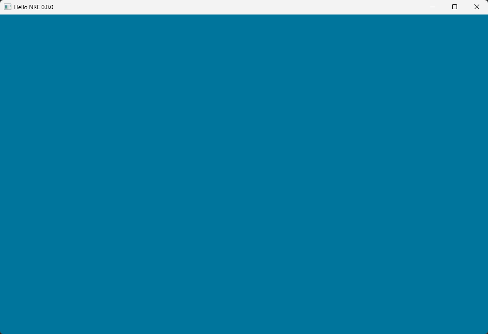
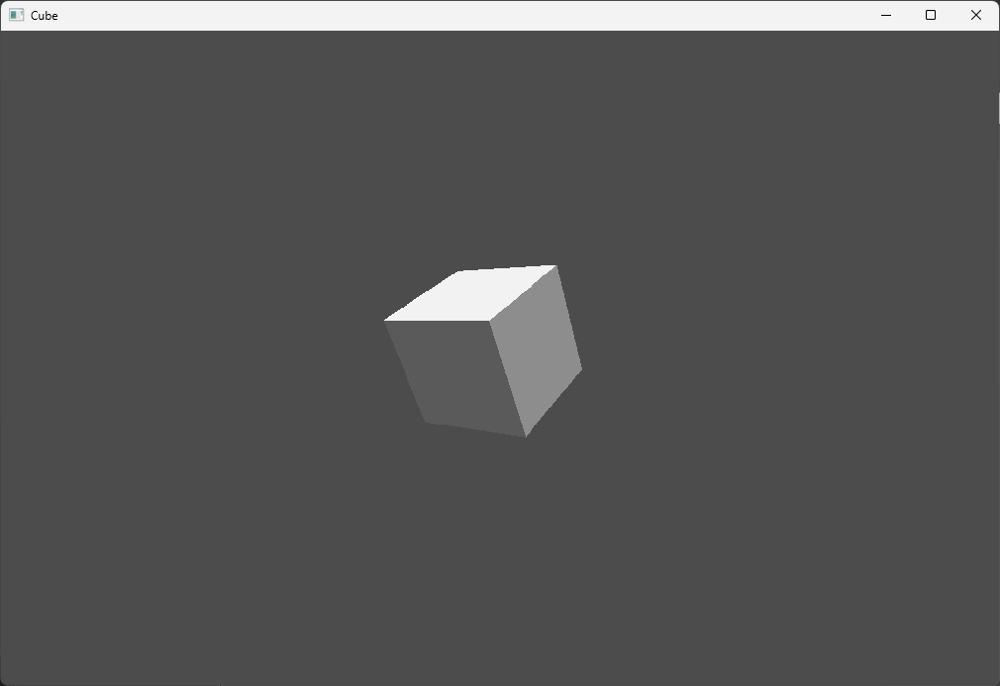
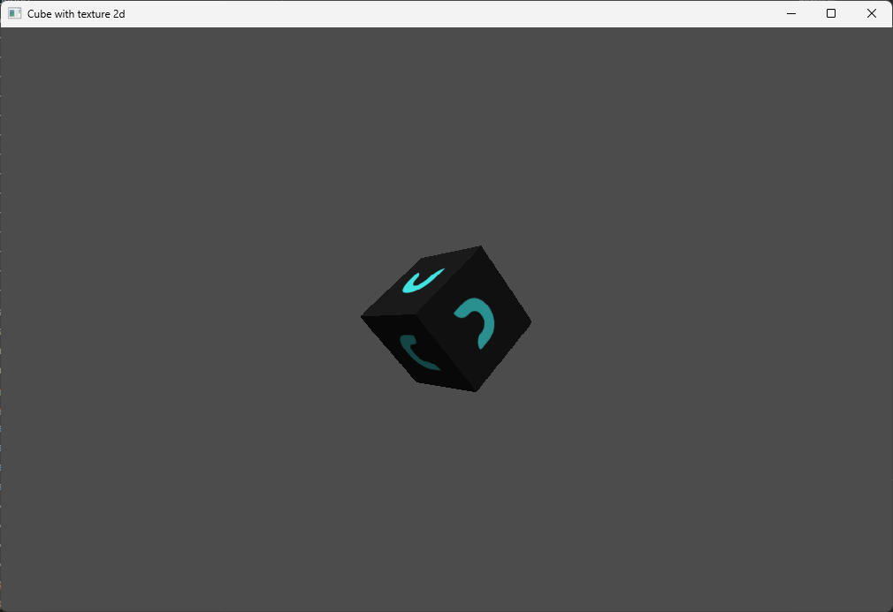
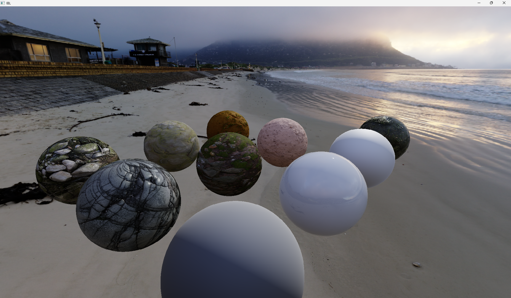

# NRE
NCoder's Learning Aimed C++ Render Engine.

---

## Features
+ 

---

## Samples
+ Hello NRE

+ Cube

+ Cube with texture 2D

+ Image Based Lighting (Diffuse + Specular)

---

## Core Dependencies
+ NCPP
+ NMath
+ NSurface
+ NRHI
+ OBJ-Loader
+ FreeImage

---

## Supported Platforms 
  + Windows

---

## Future-Compatible Platforms 
  + MacOS
  + Android
  + IOS

---

## Supported IDEs and Text Editors (for scripts)
  + Visual Studio
  + Xcode
  + CLion
  + Visual Studio Code

---

## Building
  + **Visual Studio 2022** (Windows):
    + Step 1: Clone [NRE git repository](https://github.com/Abytek/NRE) from GitHub
    + Step 2: Generate Visual Studio 2022 solution by running **scripts/generate_vs2022.bat**
    + Step 3: Navigate to **build/vs2022**
    + Step 4: Open **nre.sln**
    + Step 5: Set **nre.samples.hello_nre** as startup project
    + Step 6: Run and enjoy!
  + **Xcode** (MacOS):
    + Step 1: Clone [NRE git repository](https://github.com/Abytek/NRE) from GitHub
    + Step 2: Generate Xcode solution by running **scripts/generate_xcode.sh**
    + Step 3: Navigate to **build/xcode**
    + Step 4: Open **nre.xcodeproj**
    + Step 5: Choose **nre.samples.hello_nre** for current scheme
    + Step 6: Run and enjoy!
  + **CLion** (Windows, MacOS, Linux):
    + Step 1: Clone [NRE git repository](https://github.com/Abytek/NRE) from GitHub
    + Step 2: Open CLion by running one of these scripts based on your environment (you may need to use chmod +x command first on Linux and MacOS for execute permission):
      + Windows
        + **scripts/python_open_clion.bat**
        + **scripts/python3_open_clion.bat**
      + MacOS, Linux:
        + **scripts/python_open_clion.sh**
        + **scripts/python3_open_clion.sh** 
    + Step 3: At **On Project Wizard**, click "OK" (if you dont see it, dont worry, go to the next step).
    + Step 4: Run and enjoy!
  + **Unix makefiles**:
    + Step 1: Clone [NRE git repository](https://github.com/Abytek/NRE) from GitHub
    + Step 2: Generate makefiles by running **scripts/generate_unix_makefiles.sh**
    + Step 3: execute **scripts/build_unix_makefiles.sh** to build project
    + Step 4: Navigate to **build/unix_makefiles/nre/samples/hello_nre**
    + Step 5: Run "nre.samples.hello_nre" and enjoy!

---

## License
+ NRE is licensed under the [MIT License](https://github.com/n-c0d3r/NRE/blob/main/LICENSE)
